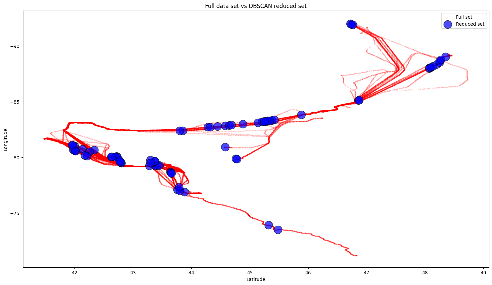
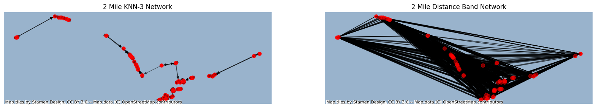

# A Geospatial Approach with Python, Clustering Techniques, and Network Analysis 

Welcome to this project blog post, where we embark on an exciting journey to explore and visualize the sea traffic in Ontario's 🇨🇦 waterways. By leveraging the power of data analysis and visualization techniques, we delve into maritime data to gain valuable insights into the movements and patterns of vessels within this region. So, let's dive right in and uncover the captivating world of geospatial traffic analysis!
  

## Dataset and Data Preparation

To efficiently handle and analyze large volumes of maritime vessel data, we utilize the Parquet file format for our dataset. Parquet is a columnar storage file format that offers exceptional performance and storage efficiency, making it ideal for handling big data.

The dataset we worked with contained information about vessels, including their Maritime Mobile Service Identity (MMSI) numbers, latitude, longitude, and report dates. This data provided a comprehensive view of vessel positions over time. Our first step was to load the dataset and select the relevant columns for our analysis. By doing so, we prepared the data to delve into the geospatial marine vessel traffic analysis in Ontario, CA.

  

```

# Load the dataset and select relevant columns

df = pd.read_parquet('Ontario_Vessels.parquet', engine='pyarrow')

df = df[['mmsi', 'lat', 'lon', 'report_date']]

df.reset_index(drop=True, inplace=True)

  

```

  

## Visualization: Mapping Sea Traffic

  

To visualize sea traffic in Ontario's waterways, we leverage various libraries such as Basemap, Matplotlib, and GeoPandas. By plotting the vessel positions on a map, we can observe the distribution and density of sea traffic in the region.

  

```

# Plot vessel positions on a map

fig = plt.figure(figsize=(10, 10))

m = Basemap(llcrnrlon=preinspection.lon.min(), llcrnrlat=preinspection.lat.min(),

urcrnrlon=preinspection.lon.max(), urcrnrlat=preinspection.lat.max(), resolution='l')

m.shadedrelief()

xy = preinspection.loc[:, ('lat', 'lon')]

plt.plot(xy.loc[:, ('lon')], xy.loc[:, ('lat')], 'o', c='red', alpha=0.1, markersize=1)

m.arcgisimage(service='World_Physical_Map', xpixels=5000, verbose=True)

plt.show()

  

```

  

The map visualization showcases the vessel positions as red dots, providing a clear representation of the areas with high traffic and popular routes. Additional layers such as shaded relief or basemaps can be overlaid to provide context and enhance the visual appeal.

<label for="image1">
  
</label>


## Clustering: Identifying Traffic Hubs

  

To identify clusters within the vessel positions and uncover traffic hubs, we apply the Density-Based Spatial Clustering of Applications with Noise (DBSCAN) algorithm. This algorithm groups nearby vessels based on their proximity, allowing us to identify congested areas or significant maritime activities.

  To apply the DBSCAN algorithm for cluster identification, we first need to convert the latitude and longitude coordinates to a format suitable for the algorithm. In this code snippet, the `coords` variable represents the selected coordinates from the dataset.

To calculate the distance between points in kilometers, we use the average radius of the Earth, which is approximately 6371.0088 kilometers per radian (`kms_per_radian`).

The `epsilon` value determines the maximum distance between points for them to be considered part of the same cluster. In this case, we set it to 1.5 kilometers divided by the `kms_per_radian` factor.

Using the DBSCAN algorithm, we fit the data with specified parameters: `eps` (epsilon) represents the maximum distance between points, `min_samples` is the minimum number of points required to form a dense region, and `metric` defines the distance metric used (in this case, 'haversine' is used to measure distances on a sphere).

After fitting the data, the resulting clusters are assigned labels (`labels`) to identify the respective clusters. The number of clusters is determined by the length of the unique labels.

To extract the clusters, a `clusters` Series is created, where each element corresponds to a cluster, represented by the coordinates within that cluster.

The `get_centermost_point` function is defined to calculate the centermost point for each cluster. It finds the centroid of the cluster using `MultiPoint` from the `shapely` library and then determines the point in the cluster closest to the centroid using the `great_circle` function.

The centermost points of each cluster are calculated and stored in a DataFrame named `rs`, which includes the latitude and longitude coordinates.

Regarding the conversion factor of kilometers per radian, it is used to ensure that the distances calculated are consistent with the Earth's spherical geometry. Since the DBSCAN algorithm uses a distance metric, we need to convert the geographic coordinates to a suitable unit of measurement (kilometers in this case) to accurately define the epsilon threshold for clustering.

```

# Apply DBSCAN algorithm to identify clusters

coords = preinspection[['lat', 'lon']].values

kms_per_radian = 6371.0088

epsilon = 1.5 / kms_per_radian

  

# Compute DBSCAN

db = DBSCAN(eps=epsilon, min_samples=20, metric='haversine', algorithm='ball_tree').fit(np.radians(coords))

labels = db.labels_

num_clusters = len(set(labels))

  

clusters = pd.Series([coords[labels == n] for n in range(num_clusters)])

  

# Calculate centermost point for each cluster

def get_centermost_point(clusters):

centroid = (MultiPoint(clusters).centroid.x, MultiPoint(clusters).centroid.y)

centermost_point = min(clusters, key=lambda point: great_circle(point, centroid).m)

return tuple(centermost_point)

  

centermost_points = clusters.map(get_centermost_point)

rs = pd.DataFrame(list(centermost_points), columns=["lat", "lon"])

  

```

  

By plotting the original vessel positions and the reduced set of centermost points on a scatter plot, we can better visualize and understand the overall distribution of sea traffic within Ontario's waterways.




## Network Analysis: Assessing Connectivity

  

To analyze the connectivity between vessels, we create network graphs based on the vessel positions. Using libraries like NetworkX and GeoPandas, we construct 3-nearest neighbor graphs and distance band graphs. These graphs represent the connections and relationships between vessels based on their proximity.

  To create network graphs, we use two approaches: K-nearest neighbors (KNN) and distance-based. 

In the code snippet provided, we first create a KNN graph using the `weights.KNN.from_dataframe` function. This function takes a dataframe (`gcd`) as input and constructs a K-nearest neighbors graph based on a specified number of nearest neighbors (`k=3` in this case). The KNN graph represents the relationships between nodes based on their proximity to each other.

Next, we create a distance-based graph using the `weights.DistanceBand.from_array` function. This function calculates pairwise distances between points in the `coordinates` array and constructs a graph based on a distance threshold (`threshold=3218.69` in this case). The distance graph represents the connections between nodes based on their distance from each other.

Both the KNN graph (`knn_graph`) and the distance graph (`dist_graph`) are converted to NetworkX graph objects using the `to_networkx()` method. NetworkX is a powerful Python library for the creation, manipulation, and analysis of complex networks.

To visualize the network graphs, we assign positions to the nodes using a dictionary called `positions`, where each node is associated with its corresponding coordinates. This allows us to plot the nodes in their spatial locations accurately.

By creating these network graphs, we can analyze the connectivity and spatial relationships between nodes in the marine vessel traffic data. These graphs serve as valuable tools for understanding the patterns and dynamics of vessel movements within the analyzed area.

```

# Create network graphs

knn3 = weights.KNN.from_dataframe(gcd, k=3)

dist = weights.DistanceBand.from_array(coordinates, threshold=3218.69)

  

knn_graph = knn3.to_networkx()

dist_graph = dist.to_networkx()

  

positions = dict(zip(knn_graph.nodes, coordinates))

  

```

  

The network graph visualization showcases the connections between vessels, providing a visual representation of the maritime network within Ontario's waterways. This analysis helps in understanding the flow of traffic, identifying key nodes or hubs, and assessing the connectivity of vessels operating in this region.




## Conclusion

  

Through the analysis and visualization of sea traffic in Ontario's waterways, we have gained valuable insights into vessel movements, traffic patterns, and key areas of interest. This analysis supports decision-making processes related to vessel operations, resource allocation, and network planning within the maritime domain.

  

Thank you for reading this project blog post. Feel free to explore the reach out for any questions!

  


**Note:** 

The dataset used in this analysis is sourced from a confidential database. However, it is important to highlight that the results and insights obtained in this analysis can be replicated using publicly available datasets with similar attributes. The purpose of this demonstration is to showcase the methodology and techniques involved in geospatial marine vessel traffic analysis.

Additionally, please be aware that the author holds the copyright to all images and visual content presented in this blog post. Any form of reproduction, distribution, or publishing of these pictures without the explicit consent of the author is strictly prohibited and may be subject to legal action.
